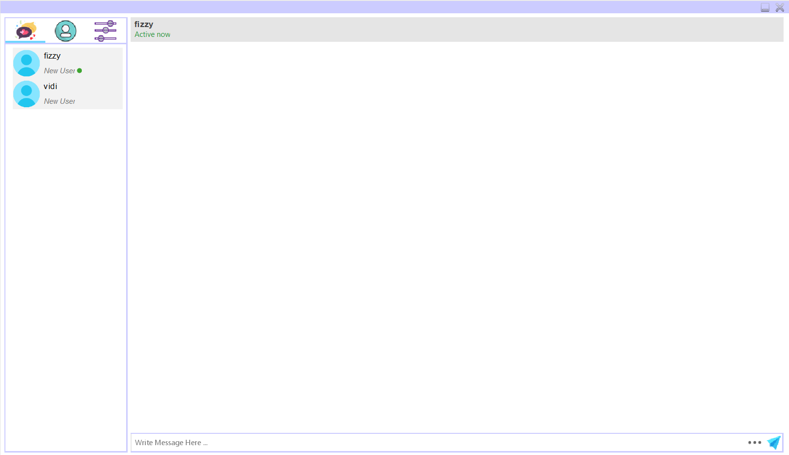
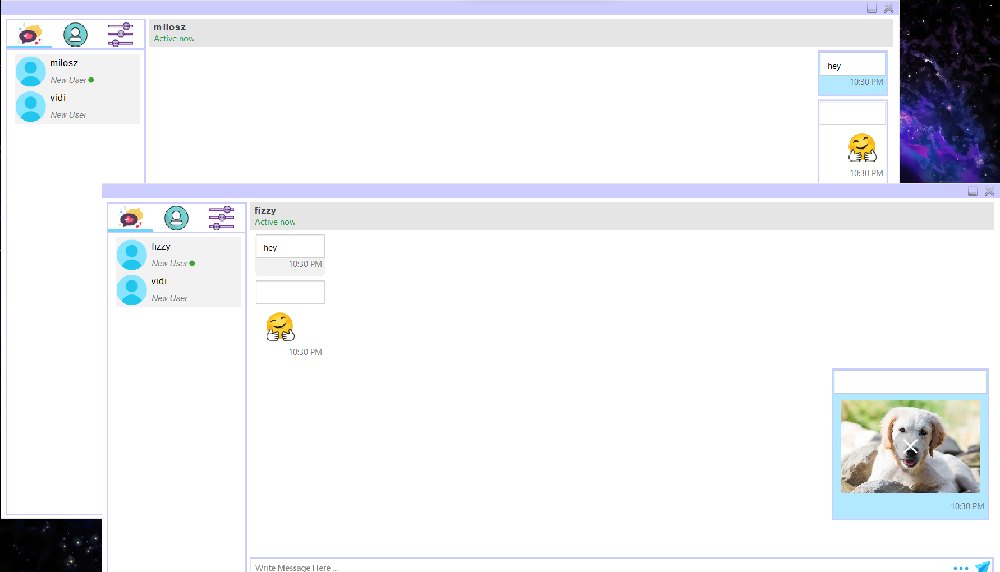

# **Tinder**
## Description

&nbsp;
>Chat application created as part of a project during the second year of Computer Science in Object-Oriented Programming (Java). The application allows you to log into your account (or create one) and chat with other people.

&nbsp;

# Instruction
## Required to run
- [*XAMPP*](https://www.apachefriends.org/pl/download.html)
- [*NetBeans*](https://netbeans.apache.org/download/index.html)

&nbsp;

## Running
- Run XAMPP Control Panel
  > Start Apach and MySQL modules
- Run Server App
  > If the following window is displayed, you are ready to start the application

  
- ⚠️ Important ⚠️
  >If you receive the error code below, go to server / connection / DatabaseConnection.java and change the port to the one shown by XAMPP for the MySQL module.

  
- Run Tinder App
  >In order to test the application, run two application windows and create two accounts. In order to receive / send a message, you must enter a specific person.

&nbsp;

## Screens from App

&nbsp;

 

  

&nbsp;
