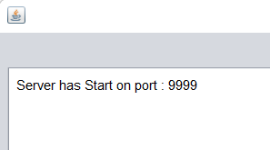
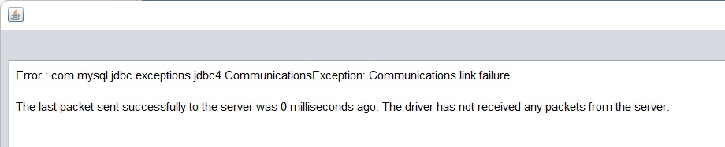

# **Tinder**
## Description

&nbsp;
>Chat application created as part of a project during the second year of Computer Science in Object-Oriented Programming (Java). The application allows you to log into your account (or create one) and chat with other people.

&nbsp;

# Instruction
## Required to run
- [*XAMPP*](https://www.apachefriends.org/pl/download.html)
- [*NetBeans*](https://netbeans.apache.org/download/index.html)

&nbsp;

## Running
- Run XAMPP Control Panel
  > Start Apach and MySQL modules
- Run Server App
  > If the following window is displayed, you are ready to start the application

  
- ⚠️ Important ⚠️
  >W przypadku otrzymania poniższego kodu błędu należy wejść w server/connection/DatabaseConnection.java i zmienić port na ten pokazywany przez XAMPP do modułu MySQL.

  
- Run Tinder App
  > You can run two Tinder application windows to test chat capability

&nbsp;

## Sample login details
- User 1
  > Login: fizzy
  > Password: 123
- User 2
  > Login: vidi
  > Password: 123
- User 3
  > Login: PanPawel
  > Password: 123
